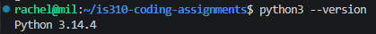
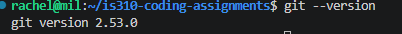
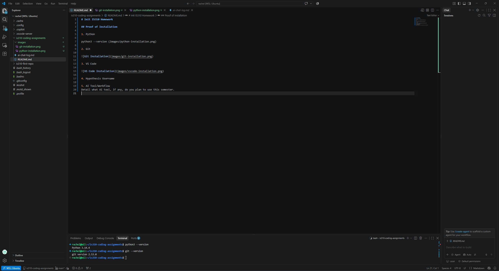

# Init IS310 Homework

## Proof of Installation

1. Python

2. Git

3. VS Code

4. Hypothesis Username
rtam7

5. AI Tool/Workflow
I plan on using ChatGPT during the semester to help me better understand course instructions and when it comes to coding because I'm not too tech savvy so I get lost here and there, needing clarification of the instructions.
